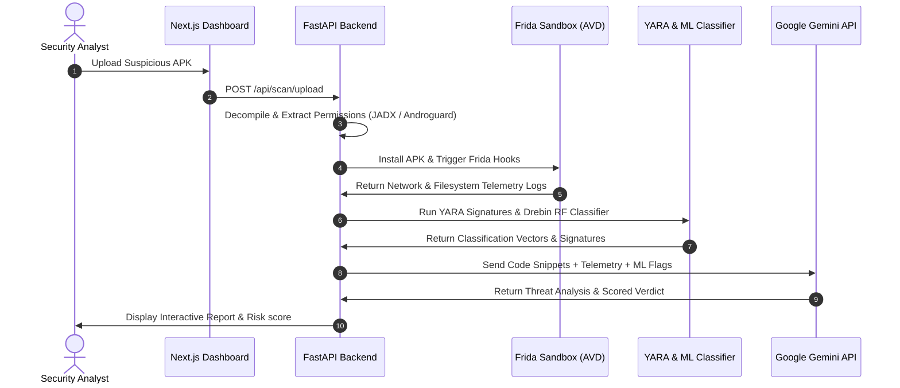

<p align="center">
  
</p>

<h1 align="center">🛡️ KAVACH AI</h1>

<p align="center">
  <strong>Generative AI-Based Automated Analysis and Risk Scoring of Fraudulent APKs</strong>
</p>

<p align="center">
  <a href="https://github.com/RamNarra/KAVACH-AI/actions/workflows/ci-main.yml"></a>
  <a href="https://github.com/RamNarra/KAVACH-AI/actions/workflows/publish-docker.yml"></a>
  
  
</p>

<p align="center">
  
  
  
  
  
</p>

---

> [!IMPORTANT]
> **KAVACH (कवच)** translates to **Shield** or **Armor** in Sanskrit. The platform acts as a defensive armor for banking customers against malicious APK clones distributed through WhatsApp, SMS, and phishing hooks.

---

## 📌 Table of Contents
*   [🚨 The Problem Statement](#-the-problem-statement)
*   [💡 The Solution Approach](#-the-solution-approach)
*   [⚙️ Core Analysis Pillars](#️-core-analysis-pillars)
*   [📊 Threat Scoring Matrix](#-threat-scoring-matrix)
*   [🏛️ Pipeline Sequence](#️-pipeline-sequence)
*   [📁 Directory Layout](#-directory-layout)
*   [🛠️ Quickstart & Installation](#-quickstart--installation)
*   [🐳 Container Deployment](#-container-deployment)
*   [💻 Technology Stack](#-technology-stack)
*   [📄 License](#-license)

---

## 🚨 The Problem Statement

Mobile fraudsters increasingly distribute cloned, fraudulent applications (APKs) via social media links (WhatsApp, Telegram) and SMS messages. These applications impersonate reputable banks to:
1.  **Steal credentials**: Inject overlay screens over legitimate banking apps.
2.  **Intercept SMS logs**: Harvest incoming OTP tokens to initiate unauthorized transfers.
3.  **Establish persistent C2 beacons**: Silently report device status to attacker servers.

Manual reverse engineering is slow and requires specialized security personnel. **KAVACH AI** automates this lifecycle, turning raw binary data into structured threat scores and natural language executive summaries.

---

## 💡 The Solution Approach

KAVACH AI provides a unified threat-scoring pipeline that integrates static analysis, dynamic emulation, machine learning, and Generative AI:

*   **AST Code Autopsy**: Decompiles APK bytecodes into clear source code trees to locate dynamic class loaders and network callbacks.
*   **Active Sandbox Telemetry**: Launches APKs headlessly, injecting Frida hooks to intercept filesystem events, SMS intercepts, and outbound network packets.
*   **Drebin Random Forest Engine**: Classifies malware based on permissions and API call vectors against a trained dataset.
*   **Generative AI Interpretation**: Uses Google Gemini to audit flagged code blocks and summarize malicious payloads in plain English.

---

## ⚙️ Core Analysis Pillars

*   **Frida Instrumentation**: Java class-level interceptors to capture runtime operations before anti-analysis or encryption kicks in.
*   **YARA Evasion Scanner**: Flags packing frameworks, anti-debugging indicators, and root-cloaking scripts.
*   **Scored PDF Audit Trails**: Instantly generates deterministic vulnerability scoring charts and reports for security teams.

---

## 📊 Threat Scoring Matrix

The scoring engine weighs multiple vectors to calculate a final rating:

| Threat Behavior | Discovery Channel | Indicator Risk | Severity Tag |
| :--- | :--- | :---: | :--- |
| **SMS Receiver Intercept** | `Frida / Manifest` | `9.8 / 10` | 🔴 **CRITICAL** |
| **Accessibility Window Inject** | `Static API Check` | `9.5 / 10` | 🔴 **CRITICAL** |
| **Unencrypted C2 HTTP Callback** | `Network Capture` | `7.8 / 10` | 🟠 **HIGH** |
| **Self-Signed Debug Certificate** | `Forensics Engine` | `4.2 / 10` | 🟡 **WARNING** |
| **Encrypted Database Save** | `Postgres DB` | `1.0 / 10` | 🟢 **SAFE** |

---

## 🏛️ Pipeline Sequence

The APK moves sequentially through the static, dynamic, ML, and LLM analysis layers:



---

## 📁 Directory Layout

```
kavach-ai/
├── backend/            # FastAPI REST backend, Requirements, and analysis engines
│   ├── rules/          # Custom YARA rules for banking fraud and evasion detection
│   └── models/         # Trained Random Forest ML classification models
├── frontend/           # Next.js App Router UI dashboard and React components
├── scripts/            # DevOps helper scripts (setup, start, verification, graph updates)
├── evals/              # Local agent evaluations harness and scenario checklists
├── .github/            # GitHub Actions CI & Docker publishing workflows
├── Dockerfile          # Root Dockerfile containerizing the main FastAPI API service
├── docker-compose.yml  # Orchestrates Redis, Postgres, MobSF, and backend services
└── README.md           # The primary project index
```

---

## 🛠️ Quickstart & Installation

### 1. Environment Setup
Clone the repository and run the setup script:
```bash
git clone https://github.com/RamNarra/KAVACH-AI.git
cd KAVACH-AI
./scripts/setup.sh
```

### 2. Configure Credentials
Open the newly created `.env` file in the root directory and add your API credentials:
```env
GEMINI_API_KEY="your-google-gemini-token"
MOBSF_API_KEY="your-mobsf-api-token"
```

### 3. Launch Local Servers
Run the unified startup script:
```bash
./scripts/start.sh
```
*   **UI Dashboard**: `http://localhost:3000`
*   **REST API Backend**: `http://localhost:8080`

---

## 🐳 Container Deployment

### Docker Compose
To boot the full suite of backend engines, database services, and cache brokers:
```bash
docker compose up -d
```

### Stand-alone Docker Run
To pull the pre-built backend package from GitHub Container Registry and run it stand-alone:
```bash
docker pull ghcr.io/ramnarra/kavach-backend:latest
docker run -d -p 8080:8080 \
  -e PORT=8080 \
  -e GEMINI_API_KEY="your-gemini-key" \
  -e MOBSF_API_KEY="your-mobsf-key" \
  ghcr.io/ramnarra/kavach-backend:latest
```

---

## 💻 Technology Stack

*   **Frontend UI**: Next.js 16 (App Router), TypeScript, React 19, Material UI, Framer Motion, D3.js.
*   **API Service**: FastAPI, Uvicorn, Celery, SQLAlchemy.
*   **Analysis Instruments**: MobSF API, Androguard, Quark Engine, Yara-Python, Frida.
*   **AI Integration**: Google GenAI SDK (Gemini 3.5), Scikit-Learn (Random Forest).
*   **Infrastructure**: PostgreSQL 17, Redis, Docker.

---

## 📄 License

Distributed under the [Apache License 2.0](LICENSE).
