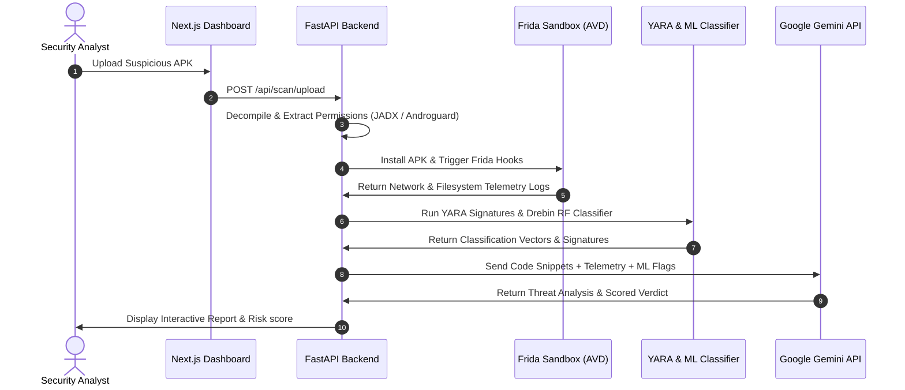

# 🛡️ KAVACH AI
### Generative AI-Based Automated Analysis and Risk Scoring of Fraudulent APKs

[](https://github.com/RamNarra/KAVACH-AI/actions/workflows/ci-main.yml)
[](https://github.com/RamNarra/KAVACH-AI/actions/workflows/publish-docker.yml)
[](LICENSE)

KAVACH AI is a Generative AI-powered malware analysis and risk-scoring platform designed to automatically analyze suspicious Android Application Packages (APKs), classify threat behaviors, and generate comprehensive security audits.

---

## 📌 Table of Contents
1. [The Problem Statement](#-the-problem-statement)
2. [The Solution Approach](#-the-solution-approach)
3. [System Pipeline & Architecture](#-system-pipeline--architecture)
4. [Key Features](#-key-features)
5. [Folder Structure](#-folder-structure)
6. [Quickstart & Installation](#-quickstart--installation)
7. [Usage & Scanning Flow](#-usage--scanning-flow)
8. [Docker (GHCR) Registry Guide](#-docker-ghcr-registry-guide)
9. [Tech Stack](#-tech-stack)
10. [License](#-license)

---

## 🚨 The Problem Statement

Fraudsters increasingly distribute malicious mobile applications (APKs) through platforms such as WhatsApp, SMS, email, and phishing links to steal customer credentials, hijack sensitive information (including SMS OTPs), and perform unauthorized financial transactions. 

Traditional mobile malware analysis relies on manual reverse engineering, which is:
*   **Complex & Time-Consuming**: Analyzing obfuscated code requires significant reverse-engineering cycles.
*   **Skill-Dependent**: Requires senior security analysts to dissect application layouts, intent structures, and dynamic payloads.
*   **Stateless**: Fails to quickly aggregate dynamic signals and ML classifications into simple, actionable intelligence for financial fraud containment.

---

## 💡 The Solution Approach

KAVACH AI bridges the gap between raw binary instrumentation and security analyst decision-making. The platform automates static decompilation, sandbox execution, signature matches, and leverages **Generative AI** to output natural language intent summaries, threat classifications, and risk scores.

```
+------------------+     +--------------------+     +------------------+
| Decompiled Code  | --> |  YARA / ML Flags   | --> | Google Gemini    | --> Investigation
| & Sandbox Logs   |     |  (Drebin Forest)   |     | (Reasoning Engine|     Report & Score
+------------------+     +--------------------+     +------------------+
```

### 1. Static Code Autopsy & Intent Deobfuscation
Suspicious APKs are unpacked and decompiled into Java sources (via JADX) and DEX bytecode structures (via Androguard). The static engine audits:
*   Requested permissions (e.g., `RECEIVE_SMS`, `READ_CONTACTS`, `SYSTEM_ALERT_WINDOW`).
*   Suspicious API calls (e.g., dynamic class loading, cryptography execution, process creation).
*   APKid classification to identify packers, compilers, and anti-debug protections.

### 2. Dynamic Sandbox Telemetry
The application is executed inside a secure, automated Android Virtual Device (AVD) container. A custom Frida script instrumentation bridge injects hooks into Java runtime APIs to capture:
*   **Network Communications**: Outbound C2 server IPs, domains, and unencrypted HTTP payloads.
*   **Filesystem Actions**: Data writes to shared preferences, database files, and dynamic Dex payloads.
*   **API Interception**: Traces cryptographic keys, SMS receiver registrations, and overlay window creations.

### 3. Generative AI Reasoning & Code Interpretation
We leverage **Google Gemini 3.5** to digest raw code and telemetry logs:
*   **Automated Code Interpretation**: Gemini inspects suspicious decompiled code blocks and explains the malicious intent (e.g. detailing how an accessibility service is used to steal banking inputs).
*   **Intelligent Threat Summarization**: Aggregates static permission flags, YARA signatures, and dynamic Frida logs into an executive security verdict.
*   **Risk Score Generation**: Synthesizes the threat indicators to calculate a final threat scoring classification (Malicious, Suspicious, Safe).

---

## 🏛️ System Pipeline & Architecture

The following diagram illustrates how an APK flows through the KAVACH AI pipeline:



---

## 🚀 Key Features

*   **Generative AI Explainability**: Translates complicated decompiled Java code and obfuscated strings into plain-English summaries.
*   **Drebin Random Forest Classifier**: Uses machine learning to verify malware classifications against historical APK datasets.
*   **Consolidated YARA Signatures**: Employs targeted YARA rules to detect root-cloaking, anti-emulation, and common evasion techniques.
*   **Accessibility overlay Detection**: Flags apps requesting permissions commonly abused in banking credential overlays.
*   **PDF Report Generation**: Exports clean audit trails containing technical findings and remediation steps.

---

## 📁 Folder Structure

```
kavach-ai/
├── backend/            # FastAPI REST backend, Requirements, and analysis engines
│   ├── rules/          # Custom YARA rules for banking fraud and packers
│   └── models/         # Trained Random Forest ML classification models
├── frontend/           # Next.js App Router UI dashboard and React components
├── scripts/            # DevOps helper scripts (setup, start, verification, graph updates)
├── evals/              # Local agent evaluations harness and scenario checklists
├── .github/            # GitHub Actions CI & Docker publishing workflows
├── Dockerfile          # Root Dockerfile containerizing the main FastAPI API service
├── docker-compose.yml  # Orchestrates Redis, Postgres, MobSF, and backend services
└── README.md           # The primary project index
```

---

## 🛠️ Quickstart & Installation

### Prerequisites
- Docker & Docker Compose
- Python 3.12+ (for local backend runs)
- Node.js 20+ & npm (for local frontend runs)

### Setup Configurations
1.  **Clone the Repository**:
    ```bash
    git clone https://github.com/RamNarra/KAVACH-AI.git
    cd KAVACH-AI
    ```
2.  **Initialize Environment & Dependencies**:
    ```bash
    ./scripts/setup.sh
    ```
    This script builds python virtual environments, installs packages, and copies `.env.example` configurations to `.env`.
3.  **Set Environment Keys**:
    Open the root `.env` file and configure:
    - `GEMINI_API_KEY`: Your Google Gemini API Key.
    - `MOBSF_API_KEY`: API token for your Mobile Security Framework docker instance.

---

## 💡 Usage & Scanning Flow

### Running the Services Locally
To boot the Next.js UI dashboard and FastAPI backend API simultaneously:
```bash
./scripts/start.sh
```
*   **Dashboard URL**: `http://localhost:3000`
*   **FastAPI backend**: `http://localhost:8080`

### Running via Docker Compose
To spin up the entire monorepo along with supporting databases (PostgreSQL, Redis, MobSF Docker):
```bash
docker compose up -d
```

### Performing a Scan
1.  Navigate to the Dashboard `http://localhost:3000` and sign in.
2.  Drag and drop an APK file into the Scanner.
3.  Observe the analysis progress (Static extraction -> Sandbox telemetry -> ML Classification -> Gemini Summarization).
4.  Download the generated Scored PDF Report.

---

## 🐳 Docker (GHCR) Registry Guide

Pre-built Docker images of KAVACH AI backend API are published to GitHub Container Registry.

### Direct Image Pull
```bash
docker pull ghcr.io/ramnarra/kavach-backend:latest
```

### Running the Container Stand-alone
```bash
docker run -d -p 8080:8080 \
  -e PORT=8080 \
  -e GEMINI_API_KEY="your-gemini-key" \
  -e MOBSF_API_KEY="your-mobsf-key" \
  -e POSTGRES_HOST="your-db-host" \
  ghcr.io/ramnarra/kavach-backend:latest
```

---

## 💻 Tech Stack

*   **Frontend**: Next.js 16 (App Router), TypeScript, React 19, Material UI, Framer Motion.
*   **Backend**: Python 3.12, FastAPI, Celery, Uvicorn.
*   **Analysis Instruments**: MobSF API, Androguard, Quark Engine, Yara-Python, Frida.
*   **AI & ML**: Google GenAI SDK (Gemini 3.5), Scikit-Learn (Random Forest).
*   **Database**: PostgreSQL 17, Redis.

---

## 📄 License

Licensed under the [Apache License 2.0](LICENSE).
