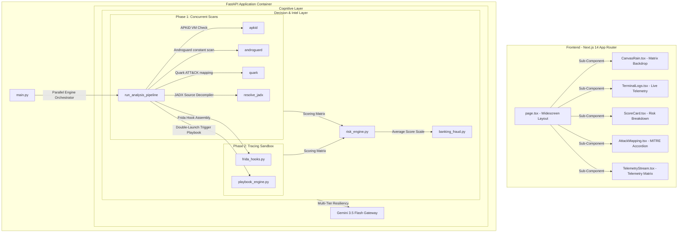

<div align="center">
  
  
  
  
</div>

<h1 align="center">🛡️ KAVACH AI</h1>

<p align="center">
  <strong>Generative AI-Powered Mobile Banking Trojan Sandbox & Explainable Threat Auditing System</strong>
</p>

Kavach AI is an automated, forensic-grade malware analysis sandbox for Android applications (`.apk`). It statically decompiles Android packages in a GIL-free concurrent pipeline, injects custom Frida hooks at runtime (intercepting deep OkHttp3 and Retrofit C2 socket channels), and leverages a **multi-tiered Google Gemini 3.5 Flash gateway** to synthesize complex bytecode/network traces into highly explainable, consumer-grade security reports.

The threat assessment is driven by a transparent **OWASP Likelihood x Impact scoring matrix**, ensuring 100% mathematical scoring determinism immune to GenAI hallucinations.

---

## ✨ Core Highlights & Technical Breakthroughs

- 🏦 **Calibrated Banking Fraud Intelligence**: Dedicated scoring model representing mobile banking trojans. Uses the average formula `((BFL + BFI) / 2) * 10` for stable, non-alarmist rating scaling that isolates SMS interceptors, Accessibility API hijacking, screen overlay theft, and dynamic keyloggers.
- 🎯 **MITRE ATT&CK Mapping**: Deep semantic code auditing (Quark Engine + Androguard DEX constant tables) dynamically maps found triggers to the standard MITRE ATT&CK Mobile matrix.
- 🔬 **OkHttp3/Retrofit Decoupled Telemetry**: Standard socket tracing hooks only capture raw encrypted binary streams. Kavach AI injects custom Frida hooks targeting `okhttp3.RealCall.enqueue` and `execute` methods to capture fully decrypted HTTP/JSON outbound payloads before TLS transport.
- 🌀 **Resilient Sandbox Spawner**: Engineered to survive virtualization lag on modern hypervisors. Implements a double-launch ADB fallback (explicit Activity starts with instant ADB `monkey` fallbacks) and advanced process searching (`pidof` + `ps -A` process parsers) over 15 attempts.
- 🧠 **Tiered Cognitive GenAI Layer**: A defensive, highly resilient AI generation gateway. Executes on `gemini-3.5-flash` under 15 RPM constraints, falls back gracefully to `gemini-3.1-flash-lite` if rate limits are exhausted, and degrades to an offline rule parser if cloud services are offline.
- 💻 **Premium Widescreen 1600px UI**: Modular, glassmorphic Next.js App Router UI styled to occupy the full widescreen width. Features visual score gauges, interactive ATT&CK accordions, live laboratory logs console, and segmented tabs (Static, Dynamic, and Combined views).

---

## 🏗️ System Architecture



---

## 🛠️ Instant Setup & Replication Guide (For another PC)

To clone and continue this project on another machine, follow these simple setup steps.

### Prerequisites
- **Python 3.11+** installed
- **Node.js 18+** & **npm** installed
- **Java JRE/JDK** installed (required by JADX & APKTool decompilers)
- **Android SDK Platform-Tools (adb)** installed and added to system `PATH`
- A Google Vertex AI or Google AI Studio Gemini API Key

---

### Step 1: Clone the Repository
```bash
git clone https://github.com/RamNarra/KAVACH-AI.git
cd KAVACH-AI
```

### Step 2: Launch the Python Backend
Run the following commands to initialize the virtual environment, install all required forensic dependencies (including `frida`, `semgrep`, `apkid`, and `androguard`), and start the uvicorn API gateway:

```bash
# Navigate to backend and create venv
cd backend
python3 -m venv venv
source venv/bin/activate

# Install all dependencies
pip install --upgrade pip
pip install -r requirements.txt

# Start uvicorn with Local Auth Bypass enabled on Port 8080
export DISABLE_AUTH=1
export GEMINI_API_KEY="YOUR_GEMINI_API_KEY_HERE"  # Add your Gemini Key
uvicorn main:app --reload --port 8080
```

*FastAPI will start, bootstrap the dynamic sandbox (locating the emulator via ADB and starting the guest Frida server), and serve endpoints on `http://localhost:8080`.*

---

### Step 3: Launch the Next.js Frontend
Open a new terminal window, navigate to the frontend directory, install npm packages, and run the developer hot-reload server:

```bash
# Navigate to frontend and install node packages
cd ../frontend
npm install

# Start the dev server mapped to local backend port
NEXT_PUBLIC_API_BASE_URL=http://localhost:8080 npm run dev
```

---

### ⚡ Quick Resume Shortcuts for Your Local Environment
Once the initial setup is complete, you can start or resume the application at any time by copy-pasting and running these commands in two separate terminal sessions:

**Session 1: Backend API Server**
```bash
# backend 
cd "/home/p4cketsn1ff3r/Downloads/Projects/KAVACH AI/backend"
source venv/bin/activate
uvicorn main:app --reload --port 8080
```

**Session 2: Frontend UI Client**
```bash
# frontend
cd "/home/p4cketsn1ff3r/Downloads/Projects/KAVACH AI/frontend"
NEXT_PUBLIC_API_BASE_URL=http://localhost:8080 npm run dev
```

*Open [http://localhost:3000](http://localhost:3000) to view the fully populated Kavach AI Widescreen Threat Dashboard. You are ready to analyze target APKs!*

---

## 🐳 Self-Hosting via Docker Compose

Alternatively, spin up the entire pre-configured ecosystem (Next.js + FastAPI decompiler backend) inside a single command using Docker:

```bash
# Create root dotenv file
echo "GEMINI_API_KEY=your_gemini_api_key_here" > .env

# Build and launch compose services
docker compose up --build
```
*Access the Next.js dashboard at [http://localhost:3000](http://localhost:3000) (backend mounts on `http://localhost:8080`).*

---

## ☁️ Production GCP Deployments

### 1. Backend Container (Cloud Run)
Deploy the FastAPI backend directly from source:
```bash
cd backend
gcloud run deploy kavach-api \
  --source . \
  --platform managed \
  --region us-central1 \
  --allow-unauthenticated \
  --memory 4Gi \
  --cpu 2 \
  --timeout 180 \
  --set-env-vars PROJECT_ID=kavach-ai-497708,LOCATION=global
```

### 2. Frontend Build (Firebase Hosting)
```bash
cd frontend
npm run build
cd ..
firebase deploy --only hosting,firestore,storage
```

---
<div align="center">
  Built with ❤️ for High-Fidelity Security Automation & Banking Protection
</div>
